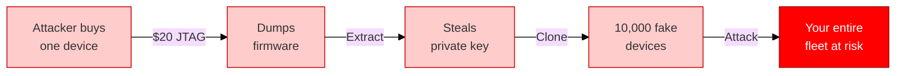
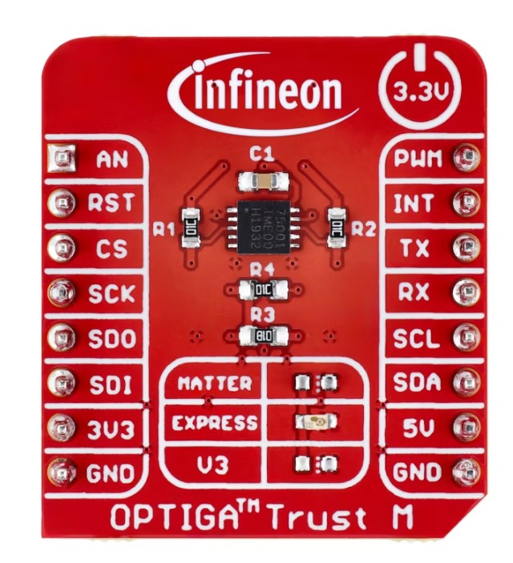
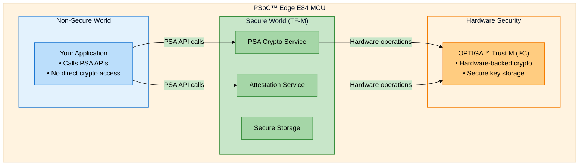
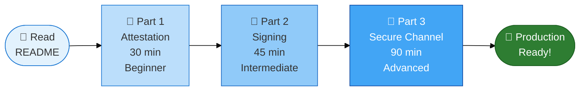
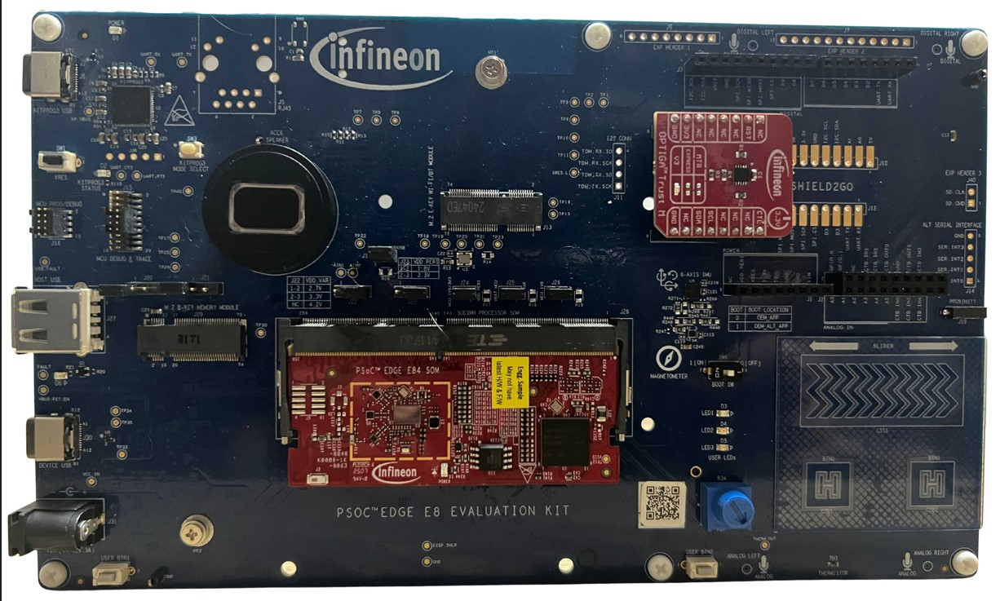
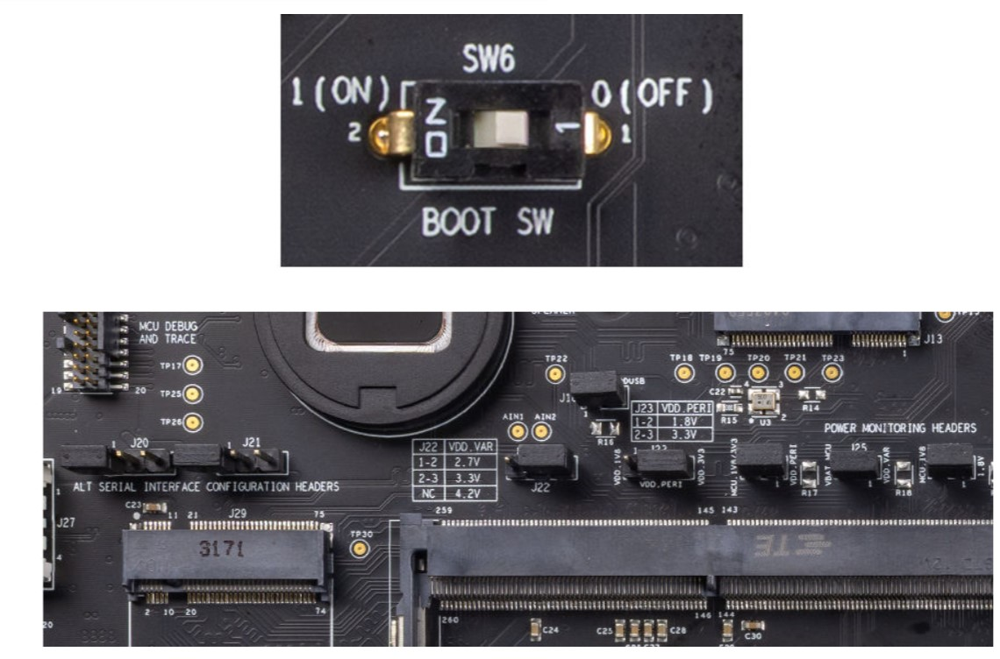

# Getting Started with OPTIGA™ Trust M on PSoC™ Edge E84

**A Hands-On Tutorial Series for Secure IoT Development**

---

## Why Hardware Security Matters

**Imagine:** You've deployed thousands of IoT sensors. One day, an attacker buys one device, dumps the firmware, extracts your private key, and clones 10,000 fake devices.

**This happens every day.** Software-only security isn't enough.



### The Problem vs The Solution

| | ❌ Software-Only | ✅ With OPTIGA™ Trust M |
|---|---|---|
| **Key storage** | In firmware (exposed) | In hardware chip (isolated) |
| **JTAG attack** | Key visible in memory | Key never enters MCU |
| **Firmware dump** | Key extracted | No key found |
| **Device cloning** | Entire fleet at risk | Each device unique |

<div align="center">



*OPTIGA™ Trust M - Hardware root of trust that protects your keys even with physical access*

</div>

**[Read full security analysis →](docs/why-optiga-trust-m.md)**

---

## What You'll Learn in This Series

This tutorial series shows you how to build **production-ready secure IoT systems** using **OPTIGA™ Trust M** with **Trusted Firmware-M (TF-M)** on a **PSoC™ Edge E84 MCU**:

### 🛡️ Part 1: Device Attestation (30 min)
**Prove your device is genuine** - Unforgeable hardware-rooted identity using OPTIGA's Initial Attestation Key

### ✍️ Part 2: Digital Signatures (45 min)
**Sign commands securely** - Hardware-protected ECDSA signing without exposing private keys

### 🔒 Part 3: Encrypted Communication (90 min)
**Protect data in transit** - End-to-end encrypted channel with AES-GCM and mutual authentication

**By the end:** You'll understand why hardware security is essential and how to deploy it in production.

---

## What Makes This Tutorial Different?

**✅ What's Included:**
- **Complete autonomous demos** - Device generates, signs, encrypts and verifies on its own
- **Serial monitor only** - No Python scripts or PC-side tools required
- **Real attack scenarios** - Understand what you're protecting against
- **Production-ready patterns** - Deploy to thousands of devices with confidence
- **Progressive learning** - Build from attestation → signing → encrypted channel

**❌ What's NOT Covered (see official docs):**
- OPTIGA provisioning details → [Infineon OPTIGA Trust M GitHub](https://github.com/Infineon/optiga-trust-m)
- Cryptographic algorithm specs → [PSA Crypto API](https://arm-software.github.io/psa-api/crypto/)
- Low-level I²C protocol → [OPTIGA Trust M Overview](https://github.com/Infineon/optiga-trust-m-overview)

---

## System Architecture Overview

The PSoC™ Edge E84 system provides hardware-isolated security layers:



**Key Security Properties:**
- ✅ **Hardware isolation** - Non-Secure code cannot access Secure memory
- ✅ **API abstraction** - Applications use standard PSA APIs
- ✅ **Hardware root of trust** - Cryptographic operations protected by OPTIGA™

---

## Tutorial Series

This series builds a **complete secure IoT communication system** in three progressive tutorials:

### 📘 Part 1: Device Identity with Attestation

**Repository:** [psoc-edge-optiga-01-attestation](https://github.com/TESA-Workshops/psoc-edge-optiga-01-attestation)

**What You'll Build:**
- Generate cryptographic attestation token proving device authenticity
- Understand TF-M Initial Attestation Service
- Use OPTIGA's Initial Attestation Key (IAK)

**Why It Matters:** Prove your device is genuine and firmware hasn't been tampered with.

**OPTIGA's Role:** Stores the IAK in hardware - creates unforgeable device identity.

**⏱️ Time:** 30 minutes | **📊 Difficulty:** Beginner

---

### 📘 Part 2: Hardware-Protected Digital Signatures

**Repository:** [psoc-edge-optiga-02-signing](https://github.com/TESA-Workshops/psoc-edge-optiga-02-signing)

**What You'll Build:**
- Sign data using ECDSA with OPTIGA device key
- View signature generation and verification via serial output
- Build foundation for command authentication

**Why It Matters:** Sign commands and data without ever exposing your private key.

**OPTIGA's Role:** Performs ECDSA signing internally - private key never enters MCU memory.

**⏱️ Time:** 45 minutes | **📊 Difficulty:** Intermediate

---

### 📘 Part 3: End-to-End Encrypted Communication

**Repository:** [psoc-edge-optiga-03-secure-channel](https://github.com/TESA-Workshops/psoc-edge-optiga-03-secure-channel)

**What You'll Build:**
- Complete secure channel (handshake + encryption)
- Mutual authentication with ECDSA signatures
- AES-GCM encrypted data transport

**Why It Matters:** Protect IoT sensor data and commands from eavesdropping and tampering.

**OPTIGA's Role:** Authenticates device identity during handshake, enabling trusted key exchange.

**⏱️ Time:** 90 minutes | **📊 Difficulty:** Advanced

---

### Learning Progression



**Total Time:** ~2.5 hours to complete all tutorials

---

## Prerequisites

### Hardware

- **PSoC™ Edge E84 Evaluation Kit** ([KIT_PSE84_EVAL_EPC2](https://www.infineon.com/cms/en/product/evaluation-boards/kit-pse84-eval-epc2/))
  - Includes integrated OPTIGA™ Trust M chip (pre-configured)
  - TF-M with OPTIGA driver already integrated
  - No additional wiring or setup required
- USB Type-C cable

<div align="center">



*PSoC™ Edge E84 board with integrated OPTIGA™ Trust M chip*

</div>

**Required jumper configuration:**

<div align="center">



*Jumper configuration: BOOT SW=OFF, J20=NC, J21=NC*

</div>

### Software

- **ModusToolbox™ 3.6+** - [Download](https://www.infineon.com/modustoolbox)
  - Includes TF-M, OPTIGA drivers, and build tools
- **Serial Terminal** (Tera Term, PuTTY, or VS Code Serial Monitor)
  - Settings: 115200 baud, 8N1, no flow control

**Note:** No Python or additional scripts required - all verification happens on-device.

### Knowledge

**Required:**
- ✅ Basic C programming
- ✅ Familiarity with build/flash workflow
- ✅ Basic understanding of cryptographic concepts

**NOT Required:**
- ❌ I²C protocol details (OPTIGA driver is pre-integrated)
- ❌ TF-M internals (PSA API provides abstraction)
- ❌ OPTIGA command protocol (handled by TF-M)

---

## Quick Start (5 Minutes)

Get hands-on with OPTIGA™ Trust M autonomous demo:

```bash
# 1. Clone the attestation example
git clone https://github.com/TESA-Workshops/psoc-edge-optiga-01-attestation
cd psoc-edge-optiga-01-attestation

# 2. Build the project
make -j8

# 3. Flash to device
make program

# 4. Open serial terminal (115200 baud, 8N1)
```

**Expected Output (Serial Monitor):**
```
PSOC Edge E84: OPTIGA Trust M Attestation Demo

[1] Generating attestation token...
    Challenge (nonce): d5913b51486dba7637eb0143d30faf2c...

[2] Signing with OPTIGA IAK...
    Token size: 559 bytes
    Token: d28443a10126a05901e3a80a5820d591...

[3] Verifying signature...
    [OK] Signature verified
    [OK] Device identity confirmed

Demo completed successfully!
```

**🎉 Success!** You just used OPTIGA™ Trust M for hardware-rooted device identity!

**👉 [See full tutorial in Part 1 repository →](https://github.com/TESA-Workshops/psoc-edge-optiga-01-attestation)**

---

## Real-World Use Cases

### Where OPTIGA™ Trust M is Deployed

| Industry | Challenge | OPTIGA Solution |
|----------|-----------|-----------------|
| **🏭 Industrial IoT** | Factory sensors send critical data - false readings disrupt manufacturing | OPTIGA attestation proves sensor authenticity + encrypted channel protects data |
| **🏥 Medical Devices** | Wearable monitors transmit health data - HIPAA requires confidentiality | Hardware-rooted encryption ensures data privacy and compliance |
| **🚗 Automotive** | Vehicles receive OTA firmware updates - malicious firmware compromises safety | OPTIGA signatures verify authentic firmware before installation |
| **💡 Smart Home** | Door locks accept unlock commands - replay attacks are a risk | Commands signed with OPTIGA + nonce prevent replay attacks |

---

## Example Projects

All example projects are in separate repositories for easy cloning:

- **[psoc-edge-optiga-01-attestation](https://github.com/TESA-Workshops/psoc-edge-optiga-01-attestation)** - Part 1: Device attestation
- **[psoc-edge-optiga-02-signing](https://github.com/TESA-Workshops/psoc-edge-optiga-02-signing)** - Part 2: Digital signatures
- **[psoc-edge-optiga-03-secure-channel](https://github.com/TESA-Workshops/psoc-edge-optiga-03-secure-channel)** - Part 3: Encrypted channel

Each project is a **complete ModusToolbox™ workspace** ready to build and flash.

---

## Additional Resources

### Official Documentation

- **[OPTIGA™ Trust M Product Page](https://www.infineon.com/optiga-trust-m)** - Datasheets, certifications
- **[OPTIGA™ Trust M GitHub](https://github.com/Infineon/optiga-trust-m)** - SDK and examples
- **[PSoC™ Edge E84 Documentation](https://www.infineon.com/cms/en/product/microcontroller/32-bit-psoc-arm-cortex-microcontroller/32-bit-psoc-edge-arm-cortex-m-based-family/psoc-edge-e84/)** - MCU reference manual
- **[ModusToolbox™ Documentation](https://www.infineon.com/modustoolbox)** - IDE and tools

### Standards & APIs

- **[PSA Crypto API](https://arm-software.github.io/psa-api/crypto/)** - API reference
- **[TF-M Documentation](https://trustedfirmware-m.readthedocs.io/)** - Trusted Firmware-M guide
- **[Common Criteria Certification](https://www.commoncriteriaportal.org/)** - Security certifications

### Community

- **[Infineon Developer Community](https://community.infineon.com/)** - Forums and discussions
- **[ModusToolbox Forums](https://community.infineon.com/t5/ModusToolbox/bd-p/ModusToolbox)** - Build system help
- **[GitHub Issues](https://github.com/TESA-Workshops/optiga-tfm-connectivity-tutorials/issues)** - Report problems

---

## Contributing

Found an issue or have suggestions?

- **Report Issues:** [GitHub Issues](https://github.com/TESA-Workshops/optiga-tfm-connectivity-tutorials/issues)
- **Ask Questions:** [Infineon Community](https://community.infineon.com/)

---

## License

- **Example Code:** MIT License
- **Documentation:** CC BY 4.0
- **OPTIGA™ and PSoC™ are trademarks of Infineon Technologies AG**

---

## Credits

- **Developed for:** TESA Training Program
- **Platform:** Infineon PSoC™ Edge E84 with OPTIGA™ Trust M
- **Security Framework:** Trusted Firmware-M (TF-M)
- **API Standard:** PSA Certified Crypto API

---

<div align="center">

**🔒 Secure your IoT devices with hardware root of trust**

[**Get Started →**](#quick-start-5-minutes) | [**Learn Why →**](docs/why-optiga-trust-m.md) | [**View Examples →**](#example-projects)

</div>
